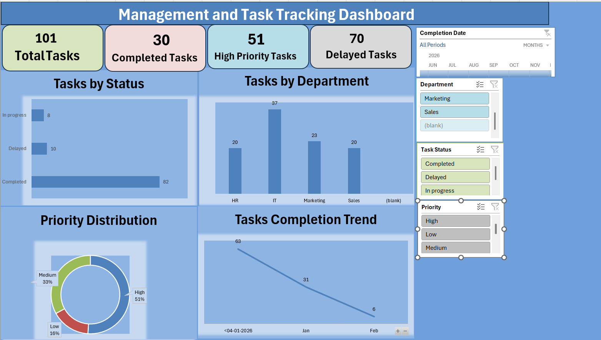

# 📊 Management & Task Tracking Dashboard

## 🚀 Project Overview

This project is an Excel-based dashboard designed to track tasks, monitor project progress, and analyze team productivity.

## 🛠 Tools Used

* Microsoft Excel
* Pivot Tables
* Charts & Visualization
* Data Analysis

## 📌 Features

* KPI Tracking (Total, Completed, Pending, Delayed)
* Interactive Dashboard
* Task Analysis by Department, Status, Priority
* Trend Analysis

## 📊 Dashboard Preview

## 💡 Key Insights

* Identifies delayed tasks
* Tracks employee performance
* Improves productivity tracking

## 📁 Files Included

* Excel Dashboard File
* Dataset
* Screenshots

## 🔗 Conclusion

This project demonstrates real-world business analysis using Excel.

